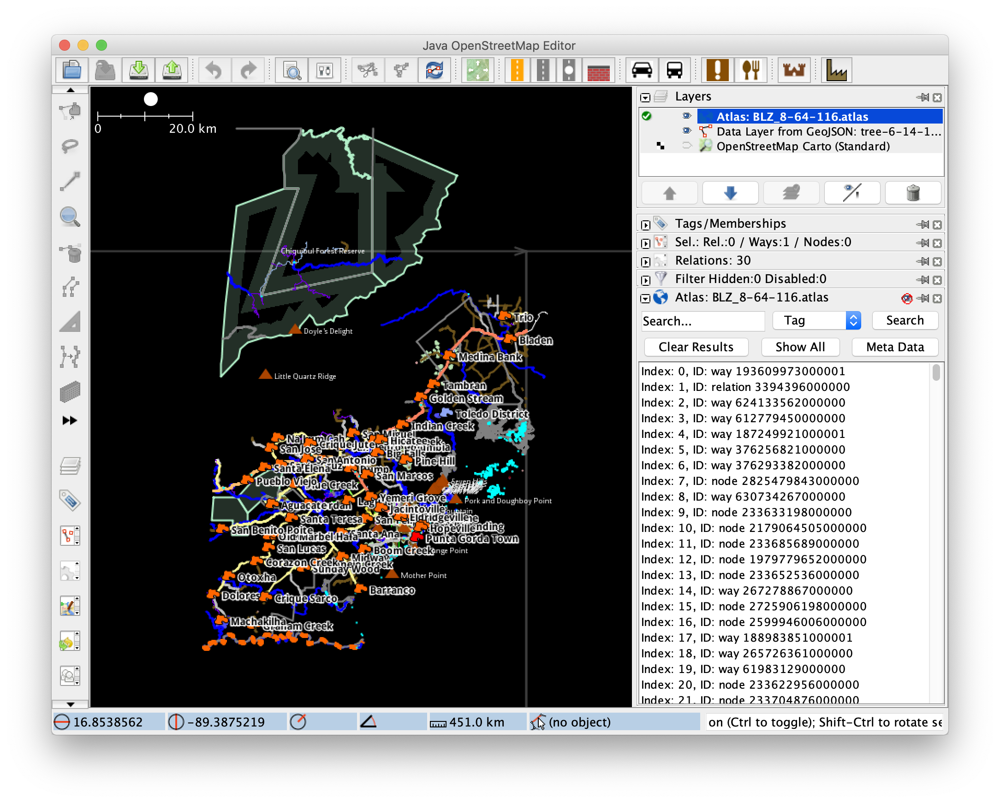
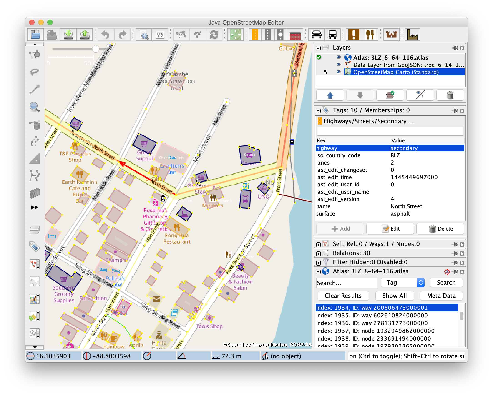

 # AtlasGenerator

[](https://travis-ci.org/osmlab/atlas-generator)
[](https://sonarcloud.io/dashboard?id=org.openstreetmap.atlas%3Aatlas-generator)
[](https://search.maven.org/search?q=g:%22org.openstreetmap.atlas%22%20AND%20a:%22atlas-generator%22)
[](https://circleci.com/gh/osmlab/atlas-generator/tree/master)

AtlasGenerator is a Spark Job that generates [Atlas](https://github.com/osmlab/atlas) shards from OSM pbf shards (built from an OSM database with osmosis).

## Getting started

This project has been implemented and tested with Oracle JDK 1.8.

### Build

The following command will compile, run checks, and build the library:

```
./gradlew clean build
```

### Setup example: BLZ (Belize)

The BLZ example can be run with this one-liner:

```
./gradlew clean run
```

#### What this does

* Downloads the country boundaries and the sharding tree files from the respective sub-folders available [here](https://apple.box.com/s/3k3wcc0lq1fhqgozxr4mdi0llf95byo3).
* Downloads a belize snapshot osm.pbf file from Geofabrik
* It tricks the program into thinking that the 3 shards Belize intersects with in this sharding tree each have a corresponding `.osm.pbf` file, which will each just be the same copy of the file that was downloaded from geofabrik:
```
./build/example/data/pbfSource/belize.osm.pbf -> ./build/example/data/pbfs/7-32-57.pbf
./build/example/data/pbfSource/belize.osm.pbf -> ./build/example/data/pbfs/8-64-116.pbf
./build/example/data/pbfSource/belize.osm.pbf -> ./build/example/data/pbfs/8-65-116.pbf
```
* Runs the `AtlasGenerator` Spark job.

#### The result

* Three atlas shards in `./build/example/output/atlas/BLZ/`
```
$ ls -alF ./build/example/output/atlas/BLZ/
-rw-r--r--  7097365 BLZ_7-32-57.atlas
-rw-r--r--  658860 BLZ_8-64-116.atlas
-rw-r--r--  590425 BLZ_8-65-116.atlas
```

Those 3 files can be loaded together at once, in the JOSM Atlas plugin for example, or programmatically loaded with a `MultiAtlas` using the [`AtlasResourceLoader` from the atlas project](https://github.com/osmlab/atlas/tree/dev/src/main/java/org/openstreetmap/atlas/geography/atlas#using-atlas).

#### How it looks like

This is one shard visualized using the josm-atlas plugin:




## Contributing

Please see the [contributing guidelines](https://github.com/osmlab/atlas/blob/dev/CONTRIBUTING.md)!
